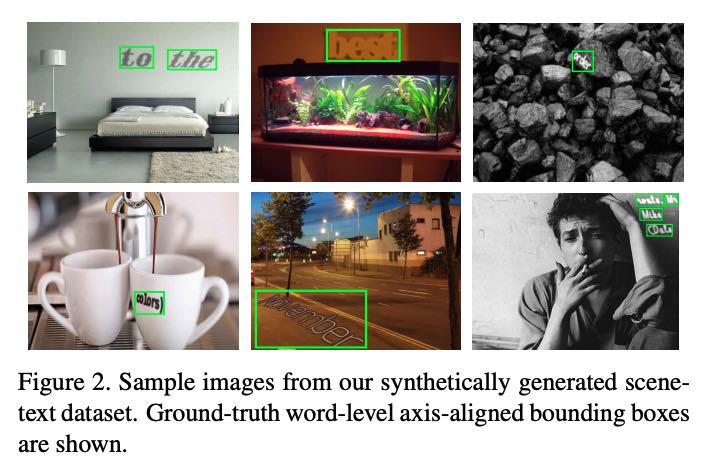
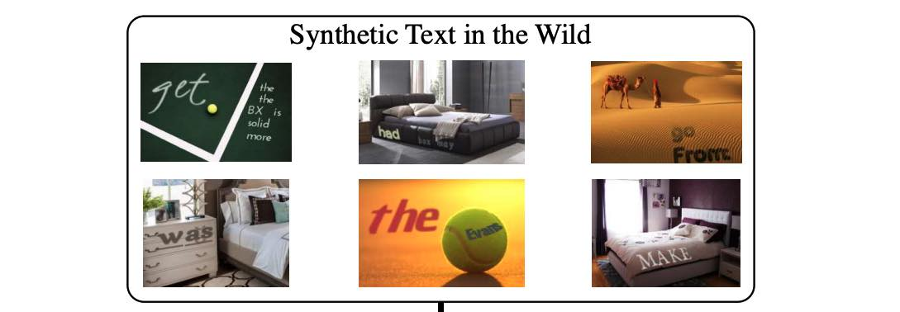
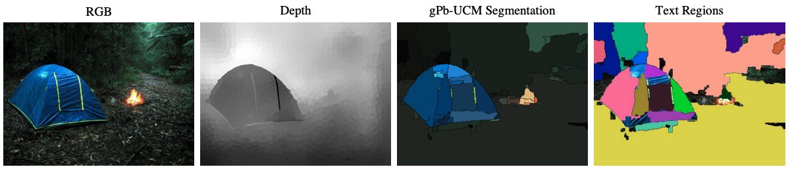
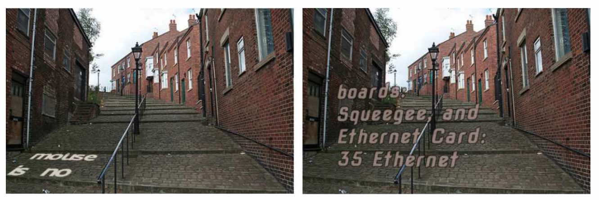

#Synthetic Data for Text Localisation in Natural Images

|[PAPER](http://openaccess.thecvf.com/content_cvpr_2016/papers/Gupta_Synthetic_Data_for_CVPR_2016_paper.pdf)| [Datasets](http://www.robots.ox.ac.uk/~vgg/data/scenetext/) |

**논문의 두 가지 공헌:**

1. 기존의 배경 이미지에 3D 공간을 고려한 자연스러운 방식으로 텍스트를 추가함으로써 빠르고 확장성이 뛰어난 텍스트 합성 이미지 생성 목적의 엔진을 제안함.
2. 텍스트 합성 이미지를 통해 Text Detection 및 Bouding-box Regression을 수행할 수 있는 FCRN(Fully-Convolutional Regression Network) 을 훈련함.

> Text-Spotting: 일상 장면으로부터 텍스트를 읽는 능력

## Intro

최근 Text-Spotting 기술은 다음의 간단하면서도 강력한 두 가지 통찰을 통해 큰 성과를 보였다:

1. 기존의 독립적으로 **텍스트 인식(Recognition)**을 구성하는 파이프라인 구성 요소들을 이미지 패치에서 직접 단어를 매핑하는 분류기로 대체 가능하다.
2. 이 강력한 분류기 모델 학습을 위해 필요한 학습 데이터를 이미지 합성을 통해 생성할 수 있다.

텍스트를 포함한 이미지 패치(Patch)가 주어졌을 때, 텍스트를 인식하는 것은 성공적이지만 여전히 전체 이미지에서 텍스트 영역을 정확하게 검출하여 이미지 패치를 얻는 것은 남은 과제이다.

정확하게 자른 단어 이미지에 대한 인식 정확도는 98%인 반면, Detection이 포함된 Text-Spotting F-Score는 69%에 불과하다.

**이러한 이유로 본 연구에서는 Text Detection 기술 발전을 위해 공헌함:**

1. Text Detection 모델 학습에 적합한 학습데이터 확보를 위해 기존의 장면이미지에 텍스트를 자연스럽게 합성하기 위한 방법 제안
2. Text Detection을 위한 fully-convolutional regression network 모델 제안

## Related Work

* 본 연구에서 제안하는 모델은 FCNs과 YOLO를 기반으로 제안함.
* 합성 텍스트 이미지 데이터
  * 합성 데이터 집합은 상세한 Ground-Truth 어노테이션을 제공하며, 쉽게 레이블링 가능하다.
  * 합성 텍스트 이미지를 활용하여 Text Recognition 모델을 학습한 연구
    * M. Jaderberg, K. Simonyan, A. Vedaldi, and A. Zisserman. Synthetic data and artificial neural networks for natural scene text recognition. In Workshop on Deep Learning, NIPS, 2014.
    * T. Wang, D. J. Wu, A. Coates, and A. Y. Ng. End-to-end text recognition with convolutional neural networks. In Proc. ICPR, pages 3304–3308, 2012.
  * 하나의 이미지를 지역 평면 영역으로 분해하기 위해 dense depth prediction을 수행한다.
    * F. Liu, C. Shen, and G. Lin. Deep convolutional neural fields for depth estimation from a single image. In Proc. CVPR, 2015.

## Synthetic Text in the Wild

Scene Text Detection & Recognition을 위한 Deep Network 모델은 많은 양을 학습 데이터를 필요로하지만, 현재 공개되어 있는 학습데이터 양은 충분하지 않다. 

이러한 이유로 모델 학습에 필요한 학습 데이터를 구축하기 위해 합성 텍스트 이미지 생성 엔진을 개발하였다.

제안하는 **Synthetic engine**은

* Scene Text Detection을 위한 모델이 실제 테스트 이미지를 일반화할 수 있는 합성 텍스트 이미지를 생성한다.
* 완벽하게 자동으로 진행되며,
* 많은 수의 학습 이미지를 빠르게 만들 수 있다.

#### SynthText Generation pipeline

1. 이미지를 지역적 색상과 질감 정보에 따라 인접 영역으로 분할(Segmentation)된다. 
   * P. Arbelaez, M. Maire, C. Fowlkes, and J. Malik. Contour detection and hierarchical image segmentation. IEEE PAMI, 33:898–916, 2011.
2. CNN을 통해 픽셀 단위의 깊이 지도를 구한다.
   * F. Liu, C. Shen, and G. Lin. Deep convolutional neural fields for depth estimation from a single image. In Proc. CVPR, 2015.
3. 텍스트의 색상 및 선택적으로 해당 지역의 색상에 따라 윤곽이 선택된다.
4. 텍스트 샘플은 무작위로 선택한 글꼴을 사용하여 렌더링되고 로컬 표면 방향에 따라 변환되며, 텍스트는 포아송 이미지 편집을 사용하여 장면으로 혼합된다.
   * P. Perez, M. Gangnet, and A. Blake. Poisson image editing. ACM Transactions on Graphics, 22(3):313–318, 2003.

#### Text/Image Sources

합성 텍스트 이미지를 생성하기 위해서는 합성에 사용될 텍스트 이미지와 배경 이미지가 필요하다.

* **텍스트 이미지**는 20 Newsgroups 데이터 집합으로부터 개별 단어, 3줄 이하의 라인, 7줄 이하의 단락을 추출한다.
  * [20 Newsgroups](http://qwone.com/~jason/20Newsgroups/) 
    * 기호, 문장 부호, 명사, 숫자와 함께 영어 텍스트의 자연스러운 분포를 갖는 데이터 집합
    * 약 20,000개의 뉴스 그룹 문서를 수집한 것

* **배경 이미지**는 구글 이미지 검색에서 물체/장면, 실내/실외 및 자연/인공 등과 관련된 쿼리를 통해 8천 개를 추출한다.
  * 완전한 Annotation을 위해 배경 이미지에는 텍스트가 포함되어 있어서는 안된다. 따라서, 배경 이미지 추출 후에 텍스트가 포함된 이미지는 제외한다.

#### Segmentation and Geometry Estimation

실제 이미지에서 텍스트는 배경의 구도를 고려한 영역에 존재한다.

왼쪽 합성 이미지의 경우 텍스트가 동일한 계단 영역을 벗어나지 않는 반면, 오른쪽 합성 이미지는 텍스트가 불연속적인 영역을 침범하고 있다. 실제 장면 이미지 내의 텍스트는 왼쪽 이미지와 같이 배치된다.

* 배경 이미지의 영역을 분리하기 위해 [Multiscale combinatorial grouping]의 효율적인 graph-cut을 사용해 gPb-UCM contour hierarchies를 0.11로 임계값화하여 구한다.
  * P. Arbelaez, M. Maire, C. Fowlkes, and J. Malik. **Contour detection and hierarchical image segmentation.** IEEE PAMI, 33:898–916, 2011.
  * P. Arbelaez, J. Pont-Tuset, J. Barron, F. Marques, and J. Malik. **Multiscale combinatorial grouping.** In Proc. CVPR, 2014.

* 실제 이미지에서는 텍스트가 표면의 결을 따라 그려지는 경향이 있다. 따라서, 배경 이미지에 텍스트를 합성할 때 영역의 표면에 대한 규칙을 파악할 필요가 있다.
  1. CNN을 활용하여 dense depth map을 예측한다.
     * F. Liu, C. Shen, and G. Lin. Deep convolutional neural fields for depth estimation from a single image. In Proc. CVPR, 2015.
  2. RANSAC을 사용하여 표면의 형태를 조정한다.
     * M. A. Fischler and R. C. Bolles. Random sample consensus: A paradigm for model fitting with applications to image analysis and automated cartography. Comm. ACM, 24(6):381– 395, 1981.

텍스트는 추정된 영역의 방향으로 정렬된다:

1. 이미지 영역 윤곽을 추정된 표면 규칙을 이용하여 정면 뷰와 평행하도록 휘게 만든다.
2. 정면으로 평행하게 휘어진 영역에 맞춰 사각형을 만든다.
3. 텍스트를 이 사각형의 넓은 부분에 정렬시킨다.

영역이 너무 작거나 종횡비가 극적인 경우, 질감이 너무 과한 경우 등은 합성 영역으로 사용하지 않는다. 

#### Text Rendering and Image Composition

텍스트의 위치와 방향이 결정되면, 색상을 정한다. 텍스트의 색상은 IIIT5K 데이터 세트의 잘라낸 단어 이미지로부터 학습된다.

각 단어 이미지의 픽셀은 색상에 대한 K-means 클러스터링을 통해 2개의 그룹으로 나뉜다. 한 그룹은 전경색을 위해, 나머지 한그룹은 배경색을 위해 사용된다.

텍스트를 렌더링할 때, Lab 색상 공간의 L2-norm에 의해 배경 이미지에 가장 적합한 배경색이 선택되면, 이에 대응되는 전경색이 텍스트 색상으로 결정된다.

텍스트의 20%는 border를 갖게되며, 텍스트 색상의 값 채널을 감소/증가 시키거나 전경색 혹은 배경색의 평균 값을 갖는 색상으로 선택된다.

합성 텍스트 이미지의 빛 경사를 유지하기 위해 Poisson image editing을 사용하여 텍스트를 베이스 이미지에 혼합한다.

* Poisson image editing: P. Perez, M. Gangnet, and A. Blake. Poisson image editing. ACM Transactions on Graphics, 22(3):313–318, 2003.
* [Fast Poisson image editing based on Discrete Sine Transform](http://web.media.mit.edu/~raskar/photo/code.pdf )

> Text Detection Network 섹션은 생략...