# PixelLink: Detecting Scene Text via Instance Segmentation

|[PAPER](https://www.aaai.org/ocs/index.php/AAAI/AAAI18/paper/view/16469/16260)|

Instance segmentation 기반의 STD(Scene Text Detection)  모델을 제안함

입력 이미지에서 텍스트 인스턴스는 분할(Segmentation)되고, 해당 분달로 부터 텍스트 Bounding Box가 추출됨.

## Intro

다음의 이미지처럼 장면 텍스트 이미지에서 각 텍스트의 인스턴스들은 서로 너무 가깝게 놓여있어 Semantic segmentation에 의해 텍스트 여부는 예측이 가능하나 각 인스턴스 간 분리가 어려운 경우가 많다.

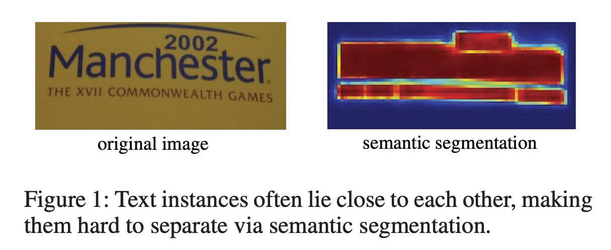

이러한 문제를 해결하기 위해 제안한 PixelLink는 픽셀 단위로 두 가지 예측을 수행한다:

* text/non-text prediction
* link prediction

link의 개념은 SegLink 모델로부터 영감을 받았지만 명백한 차이가 존재한다.

각 픽셀은 인접한 8개의 이웃 픽셀을 갖는다. 이에 따라 8개의 link ground-truth가 정의되는데, 예를 들어 왼쪽 이웃 ground-truth는 각 픽셀에 대해 왼쪽 픽셀이 동일한 인스턴스에 속하는지 여부이다. 

text/non-text prediction에서 text로 예측된 각 픽셀들은 link prediction를 통해 인스턴스로 연결된다.

> **Semantic Segmentation & Instance Segmentation**
>
> Semantic Segmentation - 이미지 내 object들을 분리하기 위해 픽셀단위로 클래스를 예측한다.
>
> Instance Segmentation - 더 나아가 동일한 클래스의 인스턴스까지 분리할 수 있도록 예측해야 한다.

## Detecting Text via Instance Segmentation

**PixelLink Framework**

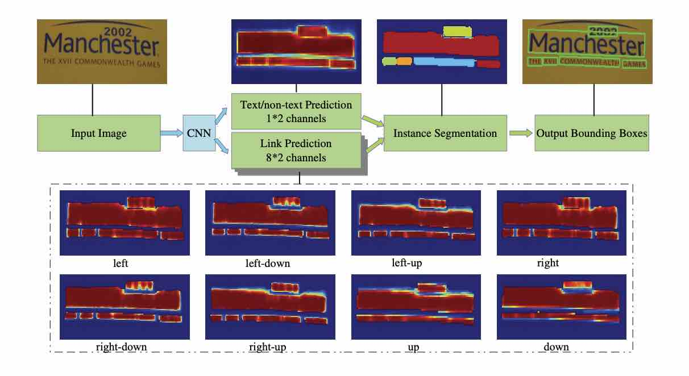

### Network Architecture

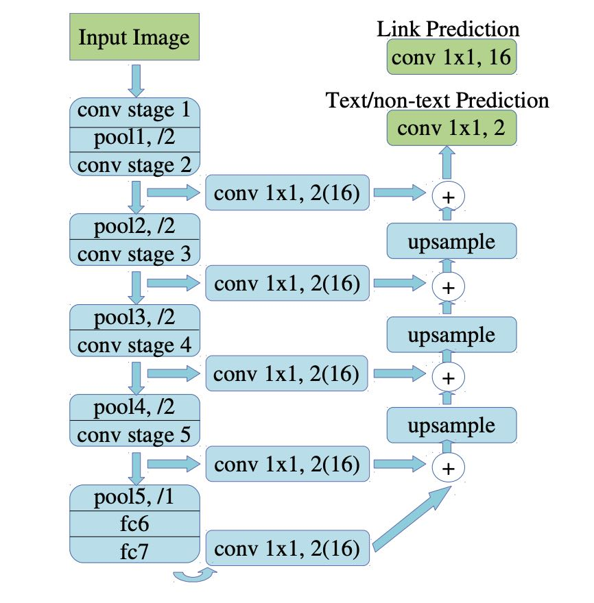

전체적인 네트워크 구조는 U-net과 흡사하다.

VGG-16에서 fully-connected layer가 Conv-layer로 대체된 구조를 기반으로하며, 

Skip architecture 구조로 얕은 레이어의 특징 맵을 깊은 레이어의 특징 맵에 결합하는 방식으로 Segmentation을 예측한다.

`PixelLink+VGG16 2s`: conv stage2의 Feature map까지 Fusion할 경우

`PixelLink+Vgg16 4s`: conv stage3의 Feature map까지만 Fusion할 경우

* Up-sampling은 bilinear interpolation
* Pool1~4는 stride 2, pool5는 stride 1
* conv 1x1, 2는 text/non-text prediction을 위해, conv 1x1 16은 link prediction을 위해 사용한다.

**픽셀 그룹화**

Network를 통해 예측된 pixel과 link를 통해 양의 픽셀을 텍스트 인스턴스로 그룹화할 수 있다. 이웃한 두 개의 positive pixel은 각각 link를 예측하며, 둘 중 하나라도 link가 positive일 경우 Connected Components 라 칭하는 하나의 인스턴스로 그룹화된다.

Instance segmentation로부터 OpenCV의 minAreaRect 함수 등을 통해 Bounding box를 구할 수 있다.

**Post-filtering**

이러한 예측 방식은 노이즈가 불가피하여 사후 필터링이 필요하다. 예를 들면, 학습 데이터의 bounding-box에 비해 그 비율이 너무 크거나 혹은 너무 작은 경우 노이즈로 판단할 수도 있다.

## Optimization

### Ground-Truth

* 텍스트 경계 상자(Bounding-box) 내의 픽셀은 positive이다. 단, 만약 두 인스턴스가 겹칠 경우, 겹치는 부분을 제외한 부분만 positive로 레이블링한다.

* 특정 픽셀과 그  픽셀에 대한 8개의 이웃 중 한 곳에 대해, 만약 동일한 인스턴스에 속한다면, 둘 사이의 link는 positive다. 

* Ground-Truth는 출력 특징 맵의 크기로 resize한 후 계산한다.

### Loss Function

Loss는 다음과 같이 pixel과 link 예측 오차에 대한 가중치 합이다.

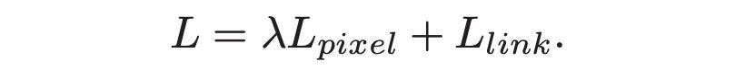

픽셀 예측에 있어서 link보다 text/non-text 예측이 더 중요하기 때문에 Lamda=2.0으로 설정한다.

**Instance-Balanced Cross-Entropy Loss**

이미지 내의 텍스트 인스턴스의 크기는 다양하다. Loss를 계산할 때, 크기가 서로 다른 인스턴스에게 동일한 가중치를 부여한다면 큰 인스턴스로만 학습이 집중될 수 있다. 이러한 문제를 다루기 위해 Segmentation을 위한 Weigted loss를 제안하였다.

가중치는 인스턴스에 포함되는 픽셀의 비율로 결정된다.

즉, 인스턴스 i의 가중치 Wi = (모든 인스턴스의 픽셀 수/인스턴스의 수) X (1/인스턴스 i의 픽셀의 수) 

이를 통해 더 작은 인스턴스에 속하는 픽셀에 가중치를 크게 주며, 각 인스턴스의 픽셀 가중치의 합이 동일하도록 만들 수 있다.

배경에 해당하는 픽셀에 대한 예측 Loss는 모두 가중치를 1로 하며, Loss가 큰 순서대로 모든 인스턴스의 픽셀 수 * 3(=r) 만큼을 선택하여 Pixel Loss로 반영한다.

결과적으로 text/non-text pixel 예측에 대한 Loss는 다음과 같다:

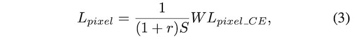

W는 앞서 언급한 가중치(Weight) 행렬이며, Lpixel_CE는 text/non-text 예측에 대한 Cross-Entropy loss다.

**Loss on Links**

link 예측에 대한 Loss는 text pixel 상에서 positive, negative link 각각 계싼한다. Non-text pixel 부분은 link loss에 포함되지 않는다.

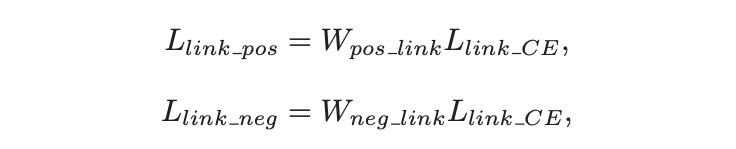

Llink_CE는 link 예측에 대한 Cross-Entropy loss이고, Wpos_link와 Wneg_link는 각각 positive link, negative link의 가중치(weight)에 해당한다. 두 가중치는 앞에서 구한 pixel의 가중치를 통해 계산할 수 있다. 

예를 들어, 픽셀 (i,j)에 대한 k번 째 이웃의 가중치는 다음과 같이 계산된다:

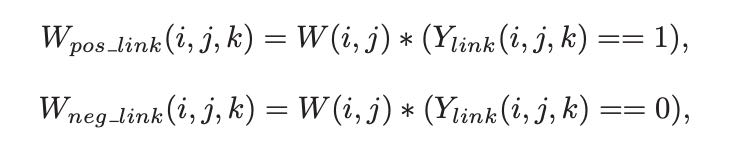

이를 기반으로 link 예측에 대한 Loss는 다음과 같다:

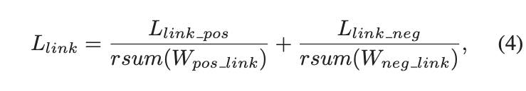

rsum은 전체 요소를 scalar로 합하는 reduce sum에 해당한다.

### Data Augmentation

* 0.2의 확율로 (0, π/2, π, 3π/2) 중 하나의 각으로 회전시킨다.
* randomly crop with areas ranging from 0.1 to 1
* aspect ratios ranging from 0.5 to 2
* 그런 다음, 512x512로 이미지 크기 변환
* Augmentation 이후 10 pixels 보다 작거나 원래 크기의 20%보다 작은 경우 해당 인스턴스는 학습에서 무시함.

### Training

* Optimized by SGD
* with momentum 0.9
* weight decay = 5x10^-4
* Xavier method를 통해 가중치 초기화
* 100iteration 동안 Learning rate 10^-3 후 Learning rate 10^-2 

## Experiments

Pixellink는 여러 벤치마크 데이터집합에서의 실험을 통해 bounding-box regression 없이도 텍스트 localization을 충분히 수행할 수 있다는 것을 보여줌

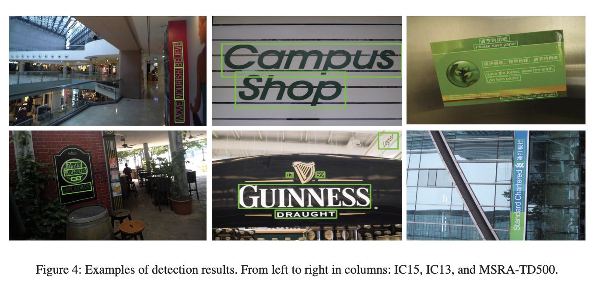

실험 데이터 집합 ICDAR2013, ICDAR2015, MSRA-TD500에 대한 결과 테이블:

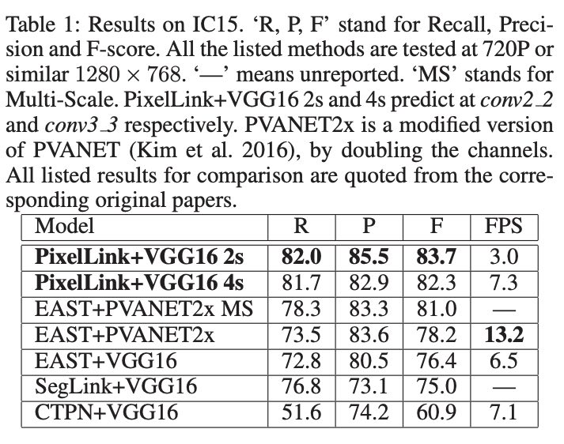

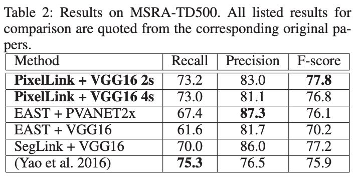

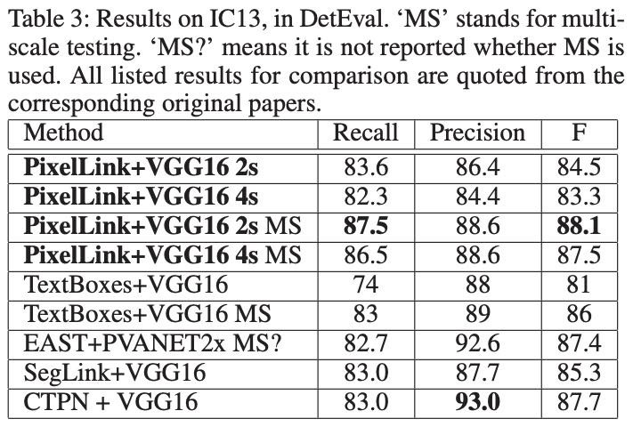

## Disscussion

### PixelLink의 장점

* Segmentation 기반 모델인 PixelLink는 Regression 기반 모델에 비해 속도 및 데이터 수에서 이점을 보임:
  * 더 빠른 학습
  * 더 적은 데이터
  * 더 나은 결과

* 가중치 초기화를 통해 처음부터 학습했음에도 ImageNet을 Fine-tune한 EAST, SegLink보다도 좋은 결과를 보여줌

어떠한 면에서 PixelLink가 더 개선된 결과를 보일 수 있었는가?

* 요구되는 Receptive Fields 차이
  * SegLink와 EAST가 동일한 backbone(VGG16)을 사용하였음에도 긴 텍스트 예측 결과의 차이를 보이는 것은 모델에게 요구되는 Receptive Field가 다르기 때문이다. SegLink는 Segmentation에 집중한 반면 EAST는 더 큰 Receptive Field가 요구되는 텍스트 전체 길이에 대한 예측을 위해 학습한다.
* 예측 문제의 난이도 차이
  * Regression 기반 모델은 Bounding-box를 예측하기 위해 정확한 네 꼭지점 좌표를 회귀해야 한다. 따라서 정교한 예측을 위해 많은 학습이 요구된다.
  * PixelLink는 픽셀 자신과 이웃 픽셀에 대한 예측을 위해 더 적은 Receptive Field가 요구된다.

### 모델 분석

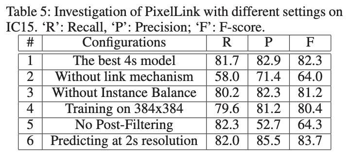

* Link는 매우 중요함
  * Link를 사용하지 않고 Pixel 예측만 할 경우 Recall, Precision, F-Score 모두 크게 떨어진다.
  * Link는 Semantic Segmentation을 Instance Segmentation으로 변환하기에 텍스트 인스턴스간 분리에 필수적인 요소이다.
* Instance-Balance 가중치 학습, 즉 인스턴스의 크기를 고려하여 가중치를 부여한 학습 방법이 더 나은 결과를 보인다.
* Post-filtering은 필수적이다.
  * post-filtering을 하지 않을 경우 precision이 크게 떨어짐
* 더 얕은 층의 특징 맵을 융합할 경우 정확도는 더 높아지고, 속도는 더 느려진다
  * speed of `PixelLink+VGG16 2s` is less than a half of `PixelLink+VGG16 4s`

