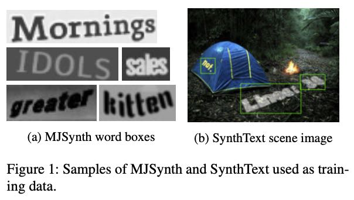
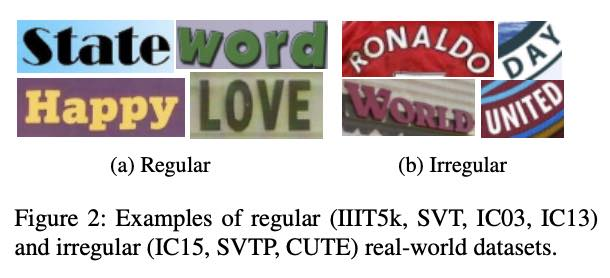
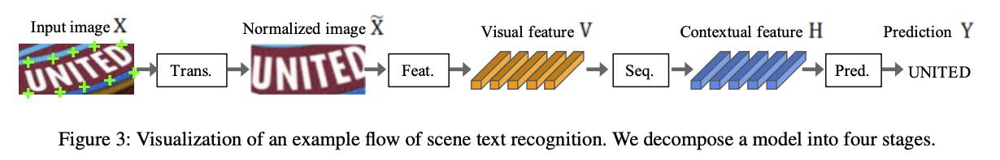
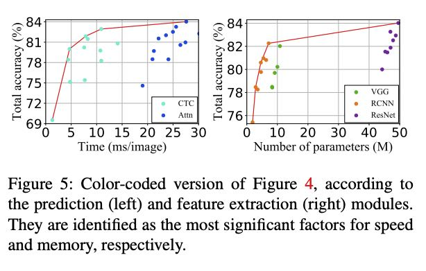
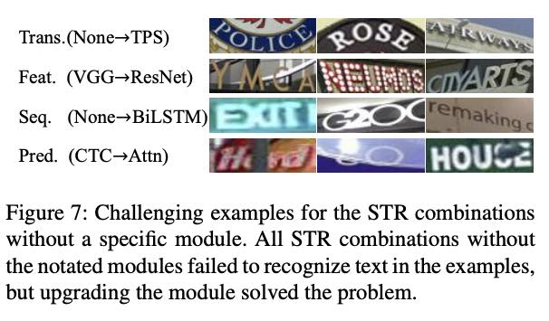
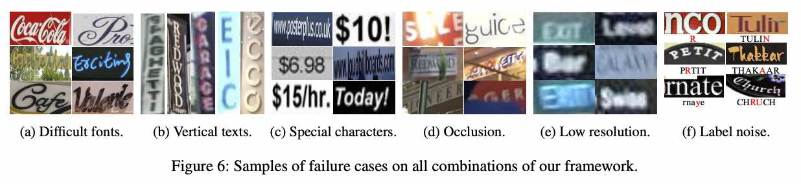

# What Is Wrong With Scene Text Recognition Model Comparisons? Dataset and Model Analysis

| [PAPER](https://arxiv.org/pdf/1904.01906.pdf) | [Github](https://github.com/clovaai/deep-text-recognition-benchmark) |

STR을 위한 다양하고 진보된 모델들이 많이 제안되었지만, 학습 및 평가 데이터 집합의 일관성 없는 선택으로 인해 전박적인 비교 공정성이 분야에서 크게 누락된 상태임.

이러한 관점에서 본 논문의 주요 세 가지 공헌:

1. 학습/평가 데이터 집합의 불일치성과 불일치로 인한 성능의 격차 등에 대한 대대적인 조사

2. 기존의 STR 모델들을 고려한 통일된 4단계의 STR 프레임워크를 제안
   - 이 프레임워크를 사용하면 이전에 제안된 STR 모듈의 광범위한 평가와 이전에 조사되지 않은 모듈 조합의 발견을 가능하게 한다.
3. 일관된 학습/평가 데이터 집합을 기반으로 정확도, 속도 및 메모리 수요 측면에서 모듈에 대한 기여도 분석
   - 이러한 분석을 통해 기존 모듈의 성능 이득을 이해하기 위한 기존의 비교의 어려움을 제거한다.

>  STR: Scene text recognition - 일상적인 장면에서 글자를 읽는다.

## Intro

OCR 시스템의 경우 잘 정돈된 문서 상에서는 성공적인 인식률을 보이지만 일상적인 장면으로부터 글자를 읽는 STR 분야에서는 텍스트 형태의 diversity와 장면 포착 상황의 불완전성 등으로 인해 어려움이 많다.

이러한 어려움을 위해 multi-stage pipelines으로 구성된 다양한 접근들이 제안되었다. 그러나 각 연구들은 학습/평가 데이터 집합에 있어서 불일치성을 보였다.  본 연구에서는 기존 연구들의 공정성 있는 비교와 기여도 평가를 위해 통일된 데이터 집합에서 평가하는 실험을 진행하였다.

또한, 4 단계로 구성된 STR 프레임워크를 정의하였다 :

- Transformation
- Feature extraction
- Sequence modeling
- Prediction

또한, 기존 연구들의 각 모듈 단위 기여도 분석을 통해 최상의 조합을 찾아 성능 개선을 보였다. 나아가 벤치마크 데이터 집합 중 실패한 경우를 분석하여 STR 분야의 남은 도전 과제를 식별하였다.

## Dataset Matters in STR

### Synthetic datasets for training

STR 모델을 학습하기 위한 labeling 작업의 비용이 너무 높기 때문에 대부분 synthetic datasets을 사용함. 최근 연구들에서 주로 사용하는 2가지 합성 이미지 데이터:

- MJSynth - STR을 위한 8.9M 단어 박스 합성 이미지 데이터 집합

  - Word box 생성 절차:
    1. Font rendering
    2. Border and shadow rendering
    3. Background coloring
    4. Composition of font, border, and background
    5. Applying projective distortions
    6. Blending with real word images
    7. Adding noise

  

- SynthText - STD를 목적으로 생성된 합성 이미지이나 cropping word boxes를 통해 STR 목적으로도 이용

  - 알파벳이 아닌 문자에 대해 Word box로 Crop 및 필터링 된 5.5M 학습 데이터집합 

  

**관련 논문**

- [(MJSynth) Max Jaderberg, Karen Simonyan, Andrea Vedaldi, and Andrew Zisserman. Synthetic data and artificial neural networks for natural scene text recognition. In Workshop on Deep Learning, NIPS, 2014.](https://arxiv.org/pdf/1406.2227.pdf)
- [(SynthText) Ankush Gupta, Andrea Vedaldi, and Andrew Zisserman. Synthetic data for text localisation in natural images. In CVPR, 2016.](http://openaccess.thecvf.com/content_cvpr_2016/papers/Gupta_Synthetic_Data_for_CVPR_2016_paper.pdf)

### Real-world datasets for evaluation

7개의 Real-word STR 데이터 집합이 주로 STR 모델 평가를 위해 널리 사용됐다. 크게 Regular datasets과 Irregular datasets으로 구분하였다.

- Regular : 수평으로 배열된 문자 사이에 일정한 공백이 있는 텍스트가 포함된 이미지 - 비교적 쉬운 데이터집합
- Irregular : 곡선형태거나 임의적 회전, 왜곡된 텍스트가 포함된 이미지 - 상대적으로 어려운 데이터집합

**Regular datasets**

- IIIT5K-Words: 구글 검색 크롤링 이미지, 2K 학습 이미지, 3K 평가 이미지
- Street View Text:  구글 Stree View에서 수집한 길거리 이미지, 257 학습 이미지, 647 평가 이미지
- ICDAR2003: 카메라 촬영 Scene text image, 1156 학습 이미지, 1110 평가 이미지(3자 미만이거나 비알파벳 포함된 이미지 제외 시 867)
- ICDAR2013: 848 학습 이미지, 1095 평가 이미지(비알파벳 포함 이미지 제외 시 1015, 3자 미만 추가 제외 시 857)

**Irregular datasets**

- ICDAR2015: 구글 글라스 착용자에 의해 촬영된 이미지로 노이즈, 블러, 회선, 저해상도 포함, 4468 학습 이미지, 2077평가 이미지(비알파벳 포함 이미지와 극심하게 변형된 이미지 제외 시 1811)
- SVT Perspective: 비정면 관점에 의한 시각적 투사 이미지가 많이 포함된 구글 Stree View에서 수집한 길거리 이미지, 645 평가 이미지
- CUTE80: 곡선형 텍스트를 많이 포함한 일상 장면 이미지, 288 cropped 평가 이미 포함

> ICDAR: Robust Reading competitions 

## STR Framework Analysis

기존에 독립적으로 수행된 STR 연구들의 공통점으로부터 파생된 STR을 위한 4단계 프레임워크를  소개하고 각 단계에 대한 선택사항을 정리함

STR은 computer vision task 및 sequence prediction task의 유사성으로 CNN과 RNN으로부터 많은 득을 볼 수 있었는데 CRNN(Convolutional-Recurrent Neural Network)이 CNN과 RNN을 조합한 STR 초기 응용이다.

CNN은 이미지의 특징을 추출하여 RNN을 이용해 시퀀스를 이해하는 접근이다. 이후 CRNN의 다양한 변형들이 제안되었다.

- 예를 들어, 임의 텍스트 기하학적 구조를 수정하기 위해 텍스트 이미지를 normalize하기 위한 변환 모듈이 제안되었다.

- 또한, 복잡한 폰트 스타일이나 어수선한 배경 등의 잠재적 어려움을 위해 개선된 CNN기반 특징 추출기를 포함시켰다.

- Inference 시간을 줄이기 위한 목적으로 RNN 단계를 생략한 모델들도 제안되었다.
- 문자 순서 예측을 개선하기 위해 Attention 기반의 디코더를 포함한 모듈도 제안되었다.

이러한 기존의 연구들을 토대로 다음과 같이 4단계의 틀을 기준으로 정의했다:

1. Transformation - STN(Spatial Transformer Network)를 이용한 입력 이미지 Normalization
2. Feature extraction - 글자와 무관한 특징(글꼴, 색상, 크기, 배경 등)을 억제하면서 입력 이미지를 문자 인식과 관련된 속성에 초첨을 맞춘 표현으로 매핑한다.
3. Sequence modeling - 마지막 예측 단계에서 각 문자에 대해 더 견고한 예측을 위해 문자의 순서 안에서 문맥 정보를 포착한다.
4. Prediction - 이미지에서 식별된 특징으로부터 문자 시퀀스를 추정한다.

**Transformation stage**

일상 장면의 텍스트 이미지에는 곡선 형태 및 기울어진 다양한 모양의 텍스트가 존재함으로 입력 이미지의 Nomarlize 단계가 필요하다. 그렇지 않을 경우 특징 추출단계에서 이러한 부분까지 고려하여 학습이 되어야 한다.

이를 위해 Transformation 단계에서는 STN(Spatial transformation network)의 변형 TPS(thin-plate spline) transformation을 적용함.

TPS는 텍스트를 둘러싼 부분에서 상단과 하단의 기준점을 찾아 미리 정의된 직사각형으로 normalize 하는 보간법(interpolation)이다.

4단계 프레임워크에서 Transformation stage는 선택사항이다.

**Feature extraction stage**

CNN을 통해 입력 이미지에 대한 특징 맵을 추출하는 단계.

VGG, RCNN, ResNet 기반의 특징 추출기를 활용함

**Sequence modeling stage**

Feature extraction stage에서 추출된 특징맵에서 컬럼을 입력 시퀀스 V로 사용되는데, 이 때 해당 시퀀스는 context 정보가 부족할 수 있음으로 Bidirectional LSTM을 이용해 컨텍스트 정보가 추가된 특징맵 H (=Seq(V))를 만드는 단계

계산/공간 복잡도를 줄이기 위해 

4단계 프레임워크에서 Sequence modeling stage는 선택사항이다.

**Prediction stage**

입력으로부터 문자 시퀀스를 예측한다. 2가지 선택사항이 있다:

- CTC (Connectionist temporal classification) : CTC는 고정된 수의 Features가 주어져도 고정되지 않은 수의 시퀀스를 예측할 수 있다. CTC는 피쳐의 컬럼별로 예측을 한 후 반복되는 문자나 빈칸을 제거함으로써 전체 문자 시퀀스를 고정되지 않은 문자 스트림으로 변경한다.
- Attn (Attention-based sequence prediction): Atn은 입력 시퀀스 내의 정보 흐름을 자동으로 인지하여 출력 시퀀스를 예측한다. 이를 통해 STR 모델이 출력 클래스 의존성을 표현하는 문자 수준의 언어를 학습할 수 있게한다.

**Paper**

- STN Paper: Max Jaderberg, Karen Simonyan, Andrew Zisserman, et al. Spatial transformer networks. In NIPS, pages 2017–2025, 2015.
- CTC Paper:Alex Graves, Santiago Fernandez, Faustino Gomez, and ´ Jurgen Schmidhuber. Connectionist temporal classification: ¨ labelling unsegmented sequence data with recurrent neural networks. In ICML, pages 369–376, 2006.
- Attn Paper:
  - Zhanzhan Cheng, Fan Bai, Yunlu Xu, Gang Zheng, Shiliang Pu, and Shuigeng Zhou. Focusing attention: Towards accurate text recognition in natural images. In ICCV, pages 5086–5094, 2017.
  - Baoguang Shi, Xinggang Wang, Pengyuan Lyu, Cong Yao, and Xiang Bai. Robust scene text recognition with automatic rectification. In CVPR, pages 4168–4176, 2016.

## Experiments and Analysis

동일한 학습/평가 데이터 하에 총 24가지의 STR 모듈 조합에 대한 실험 결과

공정한 모델 비교 평가를 위해 학습, 검증, 평가 데이터 집합을 통일함

- 학습 데이터 집합: MJSynyh 8.9M + SynthText 5.5M (총 14.4 M) 
- 검증 데이터 집합: IC13, IC15, IIIT, and SVT 학습 데이터
- AdaDelta optimizer (decay rate: 0.95)
- training batch size: 192 & 300K iteration
- Gradient clipping is used at magnitude 5.
- Parameter initialize: He’s method
- validate every 2000 training steps

**관련 논문**

[AdaDelta optimizer] - Matthew D Zeiler. Adadelta: an adaptive learning rate method. In arXiv:1212.5701, 2012.

[Parameter initialize] - Kaiming He, Xiangyu Zhang, Shaoqing Ren, and Jian Sun.
Delving deep into rectifiers: Surpassing human-level performance on imagenet classification.

STR 프레임워크의 모듈 조합에 대한 정확성, 시간, 메모리를 평가함

- 정확성 - 벤치마크의 모든 하위 집합을 포함하는 9개의 실제 평가 데이터셋에서 이미지당 단어 예측의 성공률을 측정
  - alphabets과 digits만 평가
  - 각 조합에 대해 5차례 초기화를 달리하여 실험 후 평균을 냄
- 속도 - 동일한 계산 환경에서 주어진 텍스트를 인식하기 위한 이미지당 평균 클럭 시간(밀리초)을 측정
- 메모리 - 전체 STR 파이프라인에서 훈련 가능한 매개변수의 수를 계산

학습 데이터의 경우 최상의 조합 모델을 기준으로 MJSynth와 SynthText 각각을 사용하는 것보다 함께 사용하여 학습할 경우 정확도가 높았다. 심지어 각각의 전체를 사용해 학습할 때 보다 각각의 20%를 합친 데이터집합을 통해 학습할 경우 정확도가 더 높았다. - 이것은 훈련 데이터 집합의 수보다 훈련 데이터 집합의 다양성이 더 중요할 수 있음을 시사한다.

**모듈 조합의 Trade-offs 분석**

정확도-속도 관점에서 기존 모델 중 Rosetta와 STAR-net이 선두

정확도-메모리 관점에서 기존 모델 중 R2AM이 선두

ResNet 기반 모델이 전반적으로 정확도가 높은 편이며 RCNN 기반 모델이 전반적으로 메모리가 적게 소모됨.

CTC가 Attn 보다 빠른 측면이 있으며 Attn이 더 정확한 양상을 보임. 그러나 Attn의 정확도 향상이 소모되는 시간에 비해 크지 않음. 시간에 관계 없이 정확도가 매우 중요할 경우 Attn이 적합할 수 있으나 보통의 경우에는 CTC가 유용할 수 있음.

정확도-속도 측면

ResNet, BiLSTM, TPS는 비교적 온건한 전체 감속(1.3ms→10.9ms)을 도입하는 동시에 정확도를 크게 높인다(69.5%→82.9%). 반면 Atn은 엄청난 비용(27.6ms)추가에 비해 정확도를 1.1% 향상시킬 뿐이다.

정확도-메모리 측면

transformation, sequential, and prediction modules의 선택은 메모리에 큰 영향을 주지 않음(1.9M to 7.2M)

RCNN->ResNet의 사용은 정확도 향상에 비해 메모리 필요량이 크게(7.2M to 49.6M)으로 증가함

즉, 속도 측면에서는 Prediction 모듈이, 메모리 측면에서는 Feature extration 모듈이 선택 기준의 중요함 부분임.

정확도-속도 관점 베스트 조합: **TPS-ResNet-BiLSTMT-Attn**

정확도-메모리 관점 베스트 조합: **TPS-RCNN-BiLSTM-Attn**

## Module의 역할[매우 중요한 인사이트]

모듈 적용 전에는 실패했으나 모듈 변경 후 성공한 사례:

Transformation : TPS 변환은 곡선 및 원근 문자를 표준화된 뷰로 표준화한다. 이미지 처럼 "POLICE" 원형 브랜드 로고, "AIRWAYS" 상점 간판 관점에서 크게 개선되었음 

Feature extractor : ResNet은 더 나은 표현력을 가져오고, 무거운 배경 잡동사니 "YMCA", "CITYARTS" 및 보이지 않는 글꼴("NEUMOS")을 가진 사례에서 개선된다.

Sequence modeling: BiLSTM는 수용 필드를 조정함으로써 더 나은 컨텍스트 모델링으로 이어진다. 관계없이 잘린 문자("EXIT", "G20" 끝의 "C")를 무시할 수 있음.

prediction: attention은 암묵적 문자 수준 언어 모델링은 "hard"의 "a", "to"의 "t", "HOUSE"의 "S"와 같이 누락되거나 막힌 문자를 발견한다.

**실패사례**

24개의 모든 조합에서 7.5%(644 개)에 해당 하는 이미지 내 문자들이 정확하게 인식되지 않았다. 다음과 같은 유형이다.

- Calligraphic fonts - 이처럼 다양한 문자 표현에는 일반화된 시각적 특징을 제공하는 새로운 피쳐 추출기가 필요함. 또 다른 가능한 접근 방식은 regularization, 그 이유는 모델이 교육 데이터 세트의 글꼴 스타일에 지나치게 적합할 수 있기 때문
- Vertical texts - 현재 대부분의 STR 모델은 수평 텍스트 이미지를 가정하므로 구조적으로 수직 텍스트를 처리할 수 없다. 수직 텍스트는 아직 명확하게 다루어지지 않았다. 수직 텍스트를 다루기 위해서는 더 많은 연구가 필요할 것
- Special characters(특수 문자)
- Heavy occlusions - attention이 수행한 것처럼 컨텍스트를 최대한 활용하기 위해 우수한 언어 모델을 고려할 수 있다.
- Low resolution - 기존 모델은 저해상도 사례를 명시적으로 처리하지 않는다. 이미지 피라미드나 초고해상도 모듈은 성능을 향상시킬 수 있다.
- Label noise - 모든 벤치마크 데이터셋에는 노이즈가 많은 라벨이 포함되어 있으며 특수문자를 고려하지 않은 오 라벨의 비율은 1.3%, 특수문자를 고려한 오 라벨링 비율은 6.1%, 대소문자 감도를 고려한 오 라벨링 비율은 24.1%로 나타났다.

## Conclusion

STR을 위한 모델들의 연구에서 크나큰 진전이 있었지만 비일관된 데이터 집합으로 인해 모델 간의 공정한 비교가 어려웠다.

본 연구에서는 데이터 집합을 통일시켜 기존 연구들의 4단계로 구성된 모듈별 기여도를 분석하였다. 

## TODO

- [CTC](https://mediatum.ub.tum.de/doc/1292048/file.pdf)
- Attn
  - [Attention](https://arxiv.org/pdf/1409.0473)
  - [EP](Edit probability for scene text recognition)
- [ResNet](http://openaccess.thecvf.com/content_cvpr_2016/papers/He_Deep_Residual_Learning_CVPR_2016_paper.pdf)
  - [FAN](http://openaccess.thecvf.com/content_ICCV_2017/papers/Cheng_Focusing_Attention_Towards_ICCV_2017_paper.pdf)
- [RCNN](http://openaccess.thecvf.com/content_cvpr_2016/papers/Lee_Recursive_Recurrent_Nets_CVPR_2016_paper.pdf)
  - [GRCNN](http://papers.nips.cc/paper/6637-gated-recurrent-convolution-neural-network-for-ocr.pdf)
- TPS
  - [STN](http://papers.nips.cc/paper/5854-spatial-transformer-networks.pdf)
  - [Star-net: A spatial attention residue network for scene text recognition](http://cdn.iiit.ac.in/cdn/preon.iiit.ac.in/~scenetext/files/papers/liu_bmvc16.pdf)
  - [Robust scene text recognition with automatic rectification](https://www.cv-foundation.org/openaccess/content_cvpr_2016/papers/Shi_Robust_Scene_Text_CVPR_2016_paper.pdf)
- BiLSTM
  - [2-layers BiLSTM](https://mediatum.ub.tum.de/doc/1289308/file.pdf)
  - [used in CRNN](https://arxiv.org/pdf/1507.05717.pdf)

> 기존의 모델중 SSFL은 상당히 우수한 성능을 보였는데 실험에 포함시키지 않은 이유는?