# STAR-Net: A SpaTial Attention Residue Network for Scene Text Recognition

| [PAPER](http://cdn.iiit.ac.in/cdn/preon.iiit.ac.in/~scenetext/files/papers/liu_bmvc16.pdf) |

**Scene Text Recognition(이하 STR)을 위한 End-to-End 모델을 제안함**

* 일상 이미지의 텍스트 왜곡 및 변형을 제거하기 위해 Spatial attention mechanism을 활용함.
* Residue Conv block을 통해 깊은 특징 추출기를 활용하여 Recognition 성능을 올림
* 실험 결과, 왜곡이 없는 이미지에 대해서는 최신 모델들에 준하며, 왜곡이 많은 이미지에 대해서는 성능을 뛰어넘음

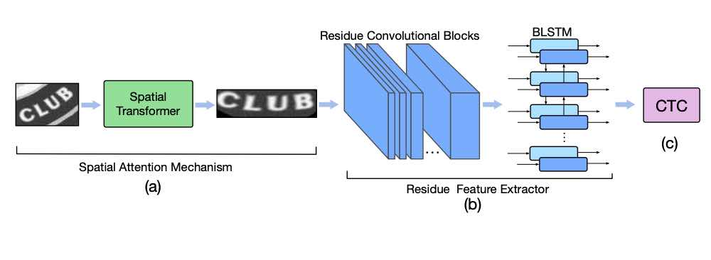

# Intro

최근 심한 왜곡 없는 타이트하게 잘린 텍스트 이미지에 대해 STR은 큰 진전을 이루었지만, 일반적인 상황에서는 다양한 종류의 왜곡이 포함되고, 느슨하게 잘린 텍스트 이미지인 경우가 많다.

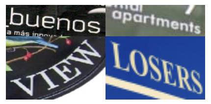

SIFT(Scale-Invariant Feature Transform) 를 활용한 접근도 있었음.

본 연구에서는 spatial attention mechanism을 활용하여 recognition에 적합한 형태로 왜곡된 텍스트 영역 이미지를 변환한 후 이것을 Residue Feature Extractor 입력으로 사용함.

* Spatial Attention mechanism을 위해 Spatial transformer module를 채택함
  * feature extractor가 본연의 목적에 집중할 수 있도록 보조함
* Feature extractor의 품질을 높이기 위해 깊은 모델에 적합한 Residue Network를 선택함
  * ResNet - BLSTM - CTC

> Spatial attention mechanism transforms a distorted text region into a canonical pose suitable for recognition

## Methodology

Star-Net은 다음의 세 주요 요소로 구성되어 있다:

### Spatial Transformer

느슨하고 왜곡된 텍스트 영역을 보다 촘촘한 경계와 정류된 텍스트 영역으로 변환함으로써 특징 추출기의 부담을 덜어주는 것이 Spatial Transformer의 목적이다.

Spatial Transformer는 Localization network, Sampler, Interpolator 세 부분으로 구성되어 있다:

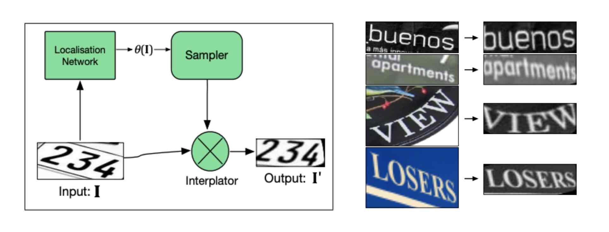

**Localization Network**

원본 이미지의 왜곡을 판단하기 위해 사용되며 변환 파라미터를 출력한다.

입력 이미지에 대해 Localization Network는 아핀변환(affine transformation)의 파라미터를 출력한다.

Localization Network를 위한 별도의 Ground-Truth는 없기 때문에 최종 Recognition 단계의 objective function에 의해   네트워크 파라미터가 알아서 학습된다.

**Sampler**

sampler는 정제된 이미지의 모든 픽셀을 위한 입력 이미지의 sampling point를 찾는 것이 목적이다.

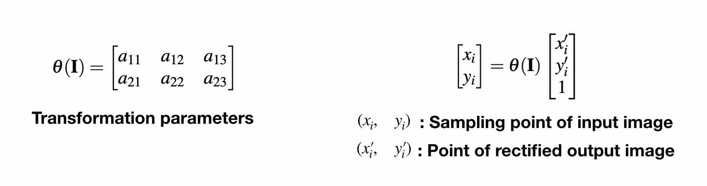

**Interpolator**

입력 이미지의 sampling point에서 가까운 네 픽셀의 intensity values로부터 bilinear interpolation을 이용하여 정제 이미지의 (x', y')에 대한 intensity value를 추정한다.

모든 연산이 미분가능하기 때문에 Gradient descent로 optimizing이 가능하다.

### Residue Feature Extractor

이미지 특징 추출을 위한 Encoder로 Residue block을 사용함으로써 네트워크가 깊어짐에 따라 발생할 수 있는 degradation problem 문제를 피했다. STAR-Net은 Residue convolutional block을 기본 요소로 사용하여 18-layers의 깊은 네트워크를 구성한다.

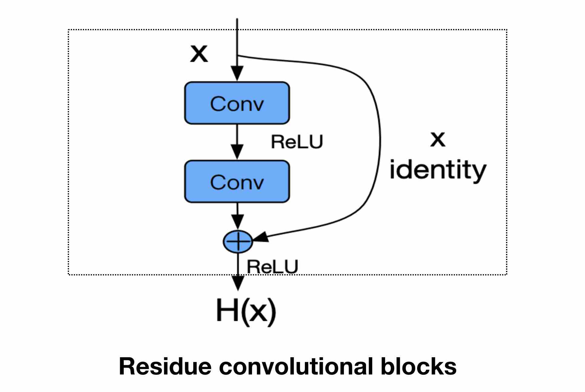

Feature Extractor 마지막 부분에 Bidirectional-LSTM layer를 추가하여 마지막 예측 단계에서 각 문자에 대해 더 견고한 예측을 위해 문자의 순서 안에서 문맥 정보를 포착한다.

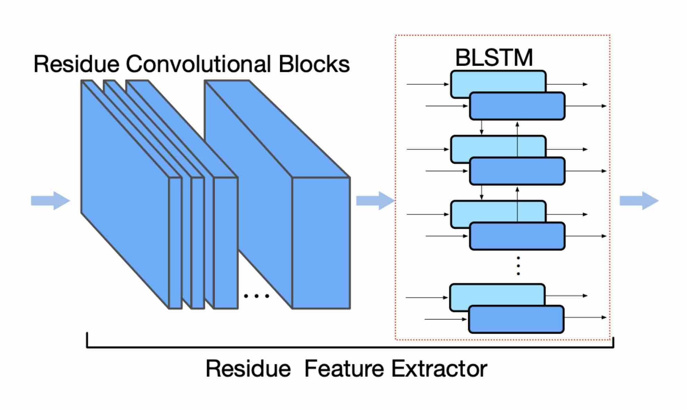

### Connectionist Temporal Classification

CTC는 디코딩을 위해 학습해야 할 파라미터가 없다. 이에 따라 특징 추출기의 중요성이 강조된다.

CTC에 대한 자세한 개념은 CTC 논문 정리 내용(예정)을 참고

## Experiment

실험 단계에서는 Star-Net을 검증하기 위해 5개의 벤치마크 데이터 집합을 사용함.

* ICDAR-2003
* ICDAR-2013
* IIIT5K
* Street View Text
* Street View Text Perspective

### Implementation Details

**Architectures**

Star-Net의 효율성을 검증하기 위해 다른 3개의 네트워크 구조와 함께 평가함

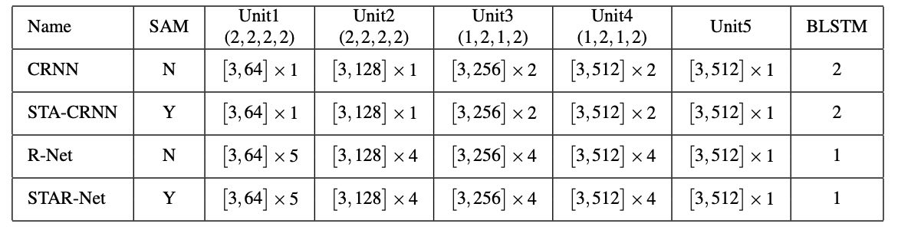

> SAM: Spatial Attention Mechanism

* CRNN: 7-layers ConvNet and two-layers BLSTM 
* STA-CRNN: CRNN with SAM
* R-Net: 8-layersConvNet include Residue and one-layers BLSTM
* STAR-Net: 26 ConvNet include Residue and one-layers BLSTM with SAM

Spatial transformer network

* 4 Plain Conv blocks
  * 3x3 Filter
  * Stride: 1
  * Padding: 1
  * Channels: (16,32,64,128 respectively)
  * 2x2 max-pooling (stride: 2)
* 256 units Fully-connected layer

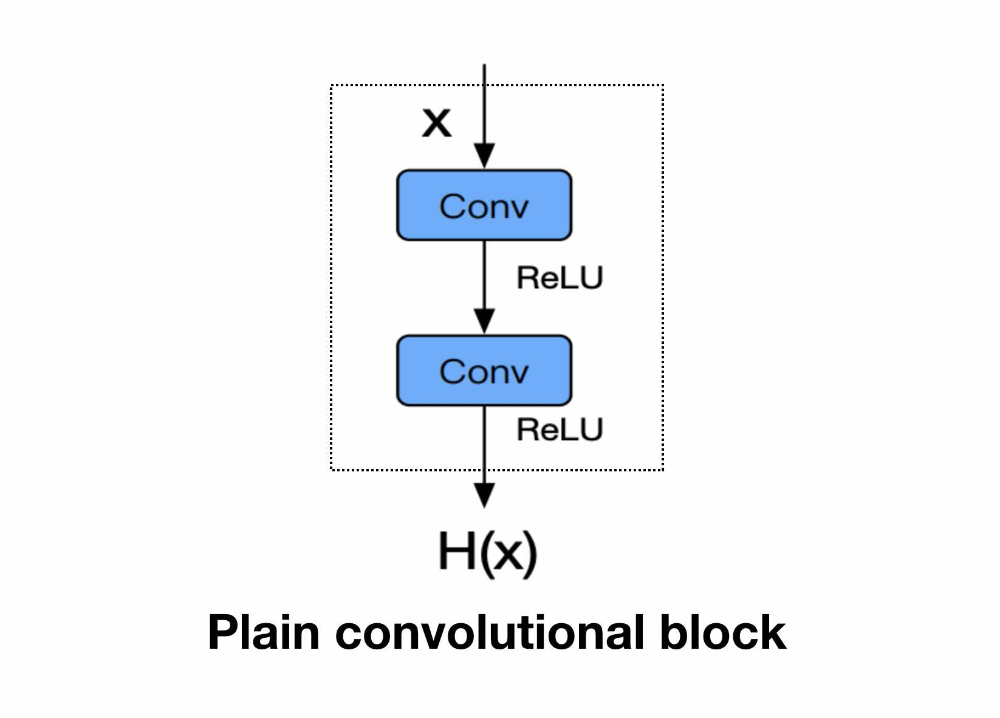

**Training**

STAR-Net은 매우 깊은 구조의 모델이기 때문에 처음부터 전체를 최적화 하는 것은 어렵다.

1. 처음에는 변형이 필요 없는 잘 정류된 입력 데이터 집합을 이용하여 Feature extractor와 CTC를 학습하는 것부터 시작한다.

2. Spatial Transformer를 추가하여 어느정도 왜곡이나 복잡성이 포함된 데이터 집합을 추가하여 학습을 더한다. 
3. 더 복잡한 왜곡을 다루기 위해 Spatial Transformer를 학습 파라미터를 유지한 채 10-Point TPS transformation로 대체하고 전체 네트워크를 fine-tune한다.

* Spatial Transformer 파라미터 초기화는 identity transformation로

* 모든 Conv-layer에 Batch Normalization 적용
* Optimized by Adadelta
* 학습 데이터는 MJSynth

**Results**

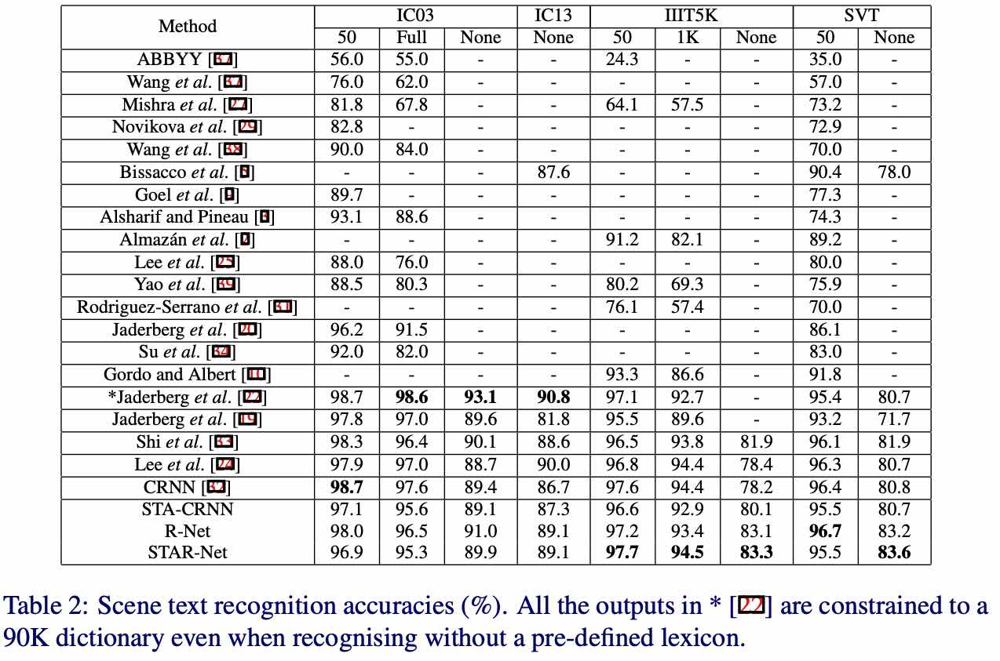

**Results on Street View Text Perspective dataset**

Street View Text Perspective dataset은 대다수의 이미지가 심각한 시각적 왜곡을 지님

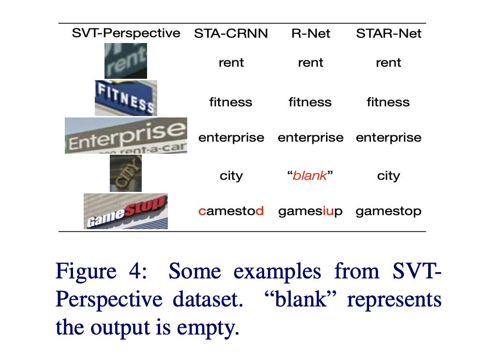

CRNN과 STA-CRNN의 결과를 비교를 통해 Spatial attention mechanism이 크게 왜곡된 텍스트 이미지에 효율적임을 보임.

R-Net은 STA-CRNN보다 약간 더 나은 성능을 얻을 수 있다는 것은 Spatial attention mechanism 없이도 깊은 네트워크가 장면 텍스트의 공간 왜곡에 네트워크를 효과적일 수 있음을 암시함.

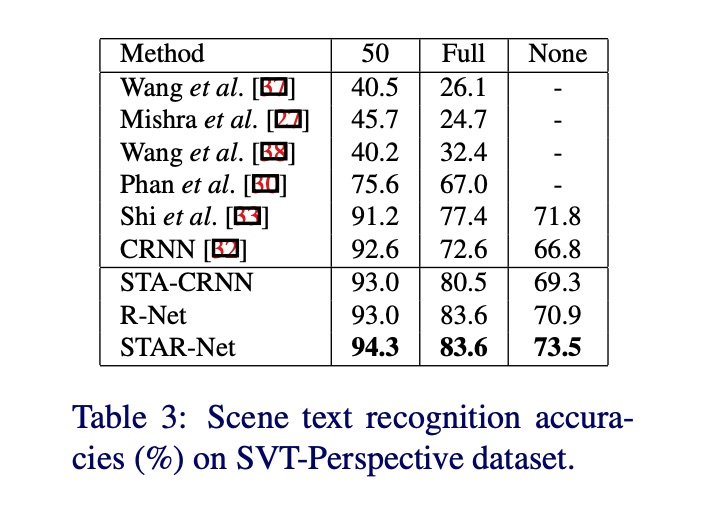

Spatial attention mechanism과 Deep ConvNet의 결합을 통해 기존 모델들 보다 복잡하고 왜곡이 심한 이미지에 대해서 개선된 성능을 보였다.

## TODO

[STN - Spatial transformer networks](http://papers.nips.cc/paper/5854-spatial-transformer-networks.pdf)

[TPS - Thin plate spline](http://members.cbio.mines-paristech.fr/~jvert/svn/bibli/local/Bookstein1989Principal.pdf)

[ResNet - Deep Residual Learning for Image Recognition](https://arxiv.org/pdf/1512.03385.pdf)

[BLSTM](https://arxiv.org/pdf/1303.5778.pdf)

[CTC - Connectionist Temporal Classification](https://mediatum.ub.tum.de/doc/1292048/file.pdf)